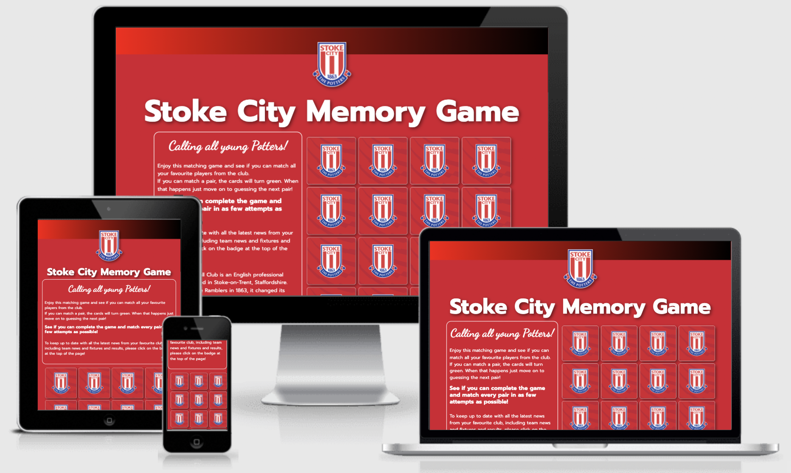
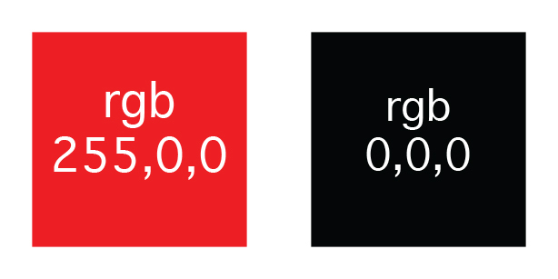

# Milestone Project 2 - Stoke City Memory Game for younger fans.

<h2 align="center"></h2>

<h2 align="center"></h2>

# Purpose

For this project I intend to design a memory game for younger Stoke City fans. This game will be constructed using knowledge gained so far on the HTML, CSS and javascript modules. The goal of the game is for children to match all the cards of their favourite players. Feedback is given when every card is matched by the player.

The live website can be found here. [link](https://robappleby1.github.io/Milestone-Project-2---stoke-city-memory-game-for-kids)

 

# Stoke City Memory Game.

The memory game will be aimed at younger Stoke City fans, who will have to match pairs of images based on the club, for example players and the stadium etc.

This game is aimed at the younger generation of fans, aimed at the 8 - 10 yars old age bracket. This idea is inspired by my daughter who has just started attending matches, and wants to learn more about the club and the players. 

 

# User Experience Design

### First Time Visitor Goals

- As a first time user I need to easily navigate through the game and be able to easily understand the rules.
- As a first time user I need to be able to view the website clearly on both tablet and mobile, as well as desktop.
- As a first time user I need to be able to easily play the game, through responsive design.
- As a first time user I need to be able to find out further information about the club via a link to their website.

### Returning Visitor Goals

- As a returning visitor I want to be able to easily find a way to play the game gain.

 

# Design

## Structure

The page will contain a fixed emblem at title block at the top of the page, which will easily identify what the page is all about. The title block will consist of the clubs badge, which will be a link to the clubs website. On the left hand side will be a text block which will incorporate a small section on information about the club, and also the rules of the game, and how to play it. On the right hand side will be the game block itself.

## Initial design Experience

The page has been designed with ease of use for the player in mind. Upon loading the players eye will immediately be drawn to the game grid due to the club crest being on the back of every card. The eye will then be drawn to the rules section which is immediately next to the game grid. The cards have an animation when you click on them, shrinking upon interaction before showing the player on the other side of the card.

## Colour Scheme

The colours I intend to use for the site are Red (rgbn255,0,0) and black (rgb 0,0,0).
This will fit in well with the club's existing team colours, and will immediately be recognised by the young fans playing the game.

 

<h2 align="center"></h2>

 

The red colour was at a later stage amended to #d7172f which is slightly more in tune with the clubs current brand identity.

 

## Typography

The logo will be made up of a title block which incorporates the clubs badge. The badge will be a link to their existing website.

- Prompt (Including all font weights)
A sans-serif font which will easily fit into the clubs existing brand styling.

## Images

The imagery used in this project is determined by images that would be recognised immediately by any young fan. This is the reason that the club crest has been used on the back of the cards, and also why the matching card images are current players, which will immediately be recognised by the player of the game.

## Responsiveness Design

- The game is designed to be fun for a young Stoke fan.
- The game keeps score of matches and attempts by the player.
- Text layout adjusts depending on screen size.
Responsiveness design of the page ensures that the game is easily played whatever the screen size, due to the reorder of columns, based on whatever device the game is being played on.

## Future Features

In the future, I would hope to add:

- Further images of different players, so the game would have a library of pictures, so different players for every game.
- An option to add and pick further difficulty levels.

 

# Wireframes

Desktop view [here](/assets/wireframes/desktop.png)

Tablet view [here](/assets/wireframes/tablet.png)

Mobile view [here](/assets/wireframes/mobile.png)

 

# Technologies used

- HTML5
- CSS3
- Javascript

 

# Frameworks and Libraries

- Bootstrap v5.1.3: Bootstrap was used to assist with the responsiveness and styling of the website. 
- Google Fonts: Google fonts were used to import the Prompt font family into the style.css file which is used on all pages throughout the project. 
- Gitpod: Git was used for version control by utilizing the Gitpod terminal to commit to Git and Push to GitHub. 
- GitHub: GitHub is used to store the project's code after being pushed from Git. 
- Photoshop: Photoshop was used to resizing images and editing photos for the website. 
- Balsamiq: Balsamiq was used to create the wireframes during the design process. 
- Chrome dev tools was used to view the site on different devices.

 

# Deployment

## Forking the GitHub Repository
By forking the GitHub Repository we make a copy of the original repository on our GitHub account to view and/or make changes without affecting the original repository by using the following steps...

Log in to GitHub and locate the GitHub Repository.
At the top of the Repository (not top of page) just above the "Settings" Button on the menu, locate the "Fork" Button.
You should now have a copy of the original repository in your GitHub account.
 

## Making a Local Clone
Log in to GitHub and locate the GitHub Repository.
Under the repository name, click "Clone or download".
To clone the repository using HTTPS, under "Clone with HTTPS", copy the link.
Open Git Bash.
Change the current working directory to the location where you want the cloned directory to be made.
Type git clone, and then paste the URL you copied.
 

## Github Pages
1. Log in to GitHub and locate the [GitHub Repository](https://github.com/).
2. At the top of the Repository locate the "Settings".
3. Click on "Pages" will open "GitHub Pages" Section.
4. Under "Source", click the dropdown called "None" and select "Main Branch".
5. The page will automatically refresh.
6. At the top near github header to locate the now published site [link](https://robappleby1.github.io/Milestone-Project-2---stoke-city-memory-game-for-kids)

 

# Testing
The Lighthouse, W3C Markup Validator, JSHint and the Lighthouse report were used to determine whether there were any
errors in the code.

- [W3C Markup Validator](assets/validators/HTML_validation.png)
- [W3C CSS Validator](assets/validators/CSS_validation.png)
- [Lighthouse report](assets/validators/lighthouse_report.png)
- [JS Hint](assets/validators/Javascript_validation.png)

 

## Testing User Stories from UX Section

  - ## First time visitor goals

- As a first time user I need to easily navigate through the game and be able to easily understand the rules.
    - Upon entering the site, the player will be greeted by a set of rules and an eye catching game grid.
 - As a first time user I need to be able to view the website clearly on both tablet and mobile, as well as desktop.
    - The game has been designed to be responsive on any device, with the columns re-arranging based on screen size,
    ensuring the game is easy to play.
 - As a first time user I need to be able to easily play the game, through responsive design.
    - The game is easy to play on any screen size due to the responsive design. On mobile devices the cards are in a 
      3 x 6 configuration to ensure that they are large enough to be responsive.
 - As a first time user I need to be able to find out further information about the club via a link to their website.  
    - At the very top of the page is a large club crest, which not only catches the eye, but is also a link when       
      clicked which takes the player to the club website, where there is further information on the club plus the ability to buy tickets etc.

 

  - ## Returning Visitor Goals

 - As a returning visitor I want to be able to easily find a way to play the game again.
    - At the bottom of the game grid will be a reset button and also a replay button on the completion of the game.

 

# Errors and Bugs

- I initially had a problem with the cards turning back too quickly, so there was not a sufficient time for the player to view both cards, and recognise that they dont match. This was rectified by an adjustment in the Javascript code. 
- My daughter played the game and reported that the card shuffle at the start of each game was not working properly, as she knew where each card would be. I amended the code slightly - bracket in the wrong place - and this rectified the issue.
 - I had an issue with the module.exports line in the javascript code, which was causing an error in the console. 
 I found an answer on [stackoverflow.com](https://stackoverflow.com/questions/66349868/jest-unit-testing-module-export-error-in-browser-console) which recified the issue.
- There is a bug in the game currently, where if you click on the cards too quickly, it breaks the game and the cards do not match anymore. In the future this will be something that I would need to look at and rectify.

 

# Further Testing

- The game was tested on Google Chrome, Firefox and Safari browsers.
- Testing was carried out to ensure all links were working correctly.
- Friends were asked to play the game and report any bugs or issues.

 

# Credits

## Code 
I was helped with this project by watching various javascript tutorials, which enabled me to build the various functions needed for this game. These were:

- Learn JavaScript by Building 7 Games - Full Course [link](https://www.youtube.com/watch?v=ec8vSKJuZTk&t=5449s)
- How To Code A Card Game In Plain JavaScript - Spooky Halloween Edition [link](https://www.youtube.com/watch?v=3uuQ3g92oPQ&t=309s)
- Awesome Vanilla JavaScript Memory Card Game Tutorial [Link](https://www.youtube.com/watch?v=-tlb4tv4mC4)
- Memory Card Game - JavaScript Tutorial [Link](https://www.youtube.com/watch?v=ZniVgo8U7ek)
- Overlay creation [Link](https://www.w3schools.com/howto/howto_css_overlay.asp)

## Media

The following images were used in the project:

- The player images that were used for the cards were all taken from the photos section of the clubs Facebook page [link](https://www.facebook.com/stokecity/photos/?ref=page_internal)
- The image of the back of the cards was taken from Sport Playslist [link](http://sportplaylists.com/get-ready-201718-stoke-city-fc-official-playlist)

 

# Acknowledgements

- Bootstrap Library used in project mainly to make site responsive.
- Images used in readme were screen shot from W3 Validators and Am I Responsive.
- Stack Overflow for advice and help regarding JEST testing.
- Prompt font supplied by Google Fonts
- My Mentor Chris Quinn for continuous helpful feedback.
- Slack community for helpful advice.
