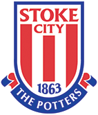

# Milestone Project 2 - Stoke City Memory Game for younger fans.

<h2 align="center"></h2>

## Purpose

For this project I intend to design a memory game for younger Stoke City fans. This game will be constructed using knowledge gained so far on the HTML, CSS and javascript modules. The goal of the game is for children to match all the cards of their favourite players. Feedback is given when every card is matched by the player.

The live website can be found here. [link](https://robappleby1.github.io/Milestone-Project-2---stoke-city-memory-game-for-kids)

 

# Stoke City Memory Game.

The memory game will be aimed at younger Stoke City fans, who will have to match pairs of images based on the club, for example players and the stadium etc.

This game is aimed at the younger generation of fans, aimed at the 8 - 10 yars old age bracket. This idea is inspired by my daughter who has just started attending matches, and wants to learn more about the club and the players. 

 

# User Experience Design

### First Time Visitor Goals

- As a first time user I need to easily navigate through the game and be able to easily understand the rules.
- As a first time user I need to be able to view the website clearly on both tablet and mobile, as well as desktop.
- As a first time user I need to be able to easily play the game, through responsive design.
- As a first time user I need to be able to find out further information about the club via a link to their website.

### Returning Visitor Goals

- As a returning visitor I want to be able to easily find a way to play the game gain.

 

# Design

## Colour Scheme

The colours I intend to use for the site are Red (rgbn255,0,0) and black (rgb 0,0,0).
This will fit in well with the club's existing team colours, and will immediately be recognised by the young fans playing the game.

 

<h2 align="center"></h2>

 

# Typography

The logo will be made up of a title block which incorporates the clubs badge. The badge will be a link to their existing website.

- Prompt (Including all font weights)
A sans-serif font which will easily fit into the clubs existing brand styling.

 

# Structure

The page will contain a fixed emblem at title block at the top of the page, which will easily identify what the page is all about. The title block will consist of the clubs badge, which will be a link to the clubs website. On the left hand side will be a text block which will incorporate a small section on information about the club, and also the rules of the game, and how to play it. On the right hand side will be the game block itself.

 

# Wireframes

Desktop view [here](/assets/wireframes/desktop.png)

Tablet view [here](/assets/wireframes/tablet.png)

Mobile view [here](/assets/wireframes/mobile.png)

 

# Technologies used

- HTML5
- CSS3
- Javascript

 

# Frameworks and Libraries

- Bootstrap v5.1.3: Bootstrap was used to assist with the responsiveness and styling of the website. 
- Google Fonts: Google fonts were used to import the Prompt font family into the style.css file which is used on all pages throughout the project. 
- Gitpod: Git was used for version control by utilizing the Gitpod terminal to commit to Git and Push to GitHub. 
- GitHub: GitHub is used to store the project's code after being pushed from Git. 
- Photoshop: Photoshop was used to resizing images and editing photos for the website. 
- Balsamiq: Balsamiq was used to create the wireframes during the design process. 
- Chrome dev tools was used to view the site on different devices.

 

# Deployment

## Forking the GitHub Repository
By forking the GitHub Repository we make a copy of the original repository on our GitHub account to view and/or make changes without affecting the original repository by using the following steps...

Log in to GitHub and locate the GitHub Repository.
At the top of the Repository (not top of page) just above the "Settings" Button on the menu, locate the "Fork" Button.
You should now have a copy of the original repository in your GitHub account.
 

## Making a Local Clone
Log in to GitHub and locate the GitHub Repository.
Under the repository name, click "Clone or download".
To clone the repository using HTTPS, under "Clone with HTTPS", copy the link.
Open Git Bash.
Change the current working directory to the location where you want the cloned directory to be made.
Type git clone, and then paste the URL you copied.
 

## Github Pages
1. Log in to GitHub and locate the [GitHub Repository](https://github.com/).
2. At the top of the Repository locate the "Settings".
3. Click on "Pages" will open "GitHub Pages" Section.
4. Under "Source", click the dropdown called "None" and select "Main Branch".
5. The page will automatically refresh.
6. At the top near github header to locate the now published site [link](https://robappleby1.github.io/user-centric-milestone-project/)

 

# Testing
The Lighthouse, W3C Markup Validator and the Lighthose report were used to determine whether there were any
errors in the code.

- [W3C Markup Validator]()
- [W3C CSS Validator]()
- [Lighthouse report]()

## Testing User Stories from UX Section

-

 

- 

# Errors and Bugs

- 

# Further Testing

- 

 

# Credits
## The following images were used in the project:
 

- 

 

# Credits

- 

 

# Acknowledgements

